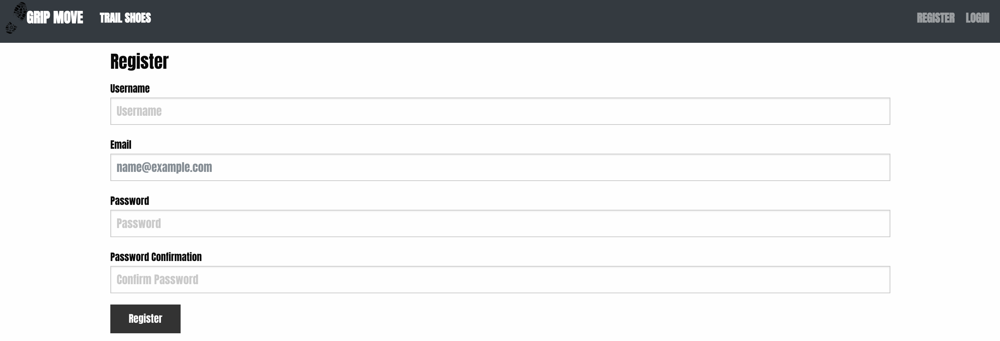
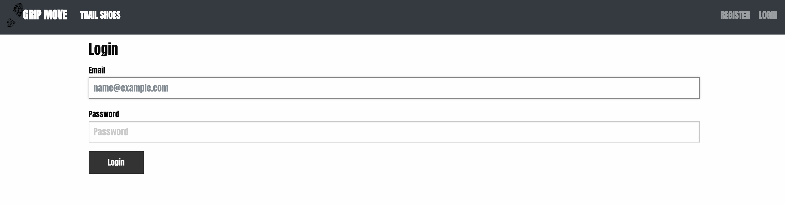
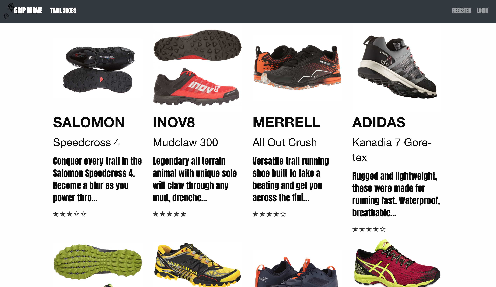
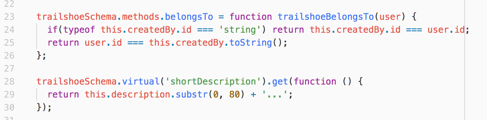

#  

# WDI PROJECT 2

## Brief
To build a full-stack RESTful application that includes authentication. Challenge to build this within Express that includes a Mongo database using Mongoose ORM.

## Technologies Used / Stack

### Server-side

- MongoDB
- Mongoose
- Node.js
- Express.js
- JavaScript
- Gulp.js

### Client-side

- JavaScript
- HTML
- CSS
- SCSS
- Bootstrap Framework
- EJS
- Babel

## Local Set-up of Dependencies

Clone or download the repository and navigate to it's root in the terminal.

- run `yarn` / `npm i`
- run `mongod`
- run `gulp`
- run `node db/seeds`
- Navigate to `http://localhost:3000`

## Overview
As an avid runner, the original idea for this application was based around running trails around London for users to login, upload and rate. Since this was early on in the course and given the time constraints, I built the application around the add on resource I would base the app upon which is rating of trail running shoes. Users can register and upload trail running shoes and give write their own reviews. Other users can then view and comment on these trail running shoes.

I planned the project using a Trello board to break down tasks and to ensure I was on target to finish in the short time frame available. I also wireframed the application briefly using Adobe XD.

## Mechanics

### Landing Page of the Website

Image 1: Landing Page

The landing page was chosen to visually represent outdoor lifestyle and trails in general. I preference a minimum style, which is in-keeping with the rugged, outdoors, simple lifestyle. To keep the application "clean", I utilised a white background with dark, neutral toned navbar.

### Register / Login

Image 2: Register Page

Image 3: Login Page

Users are able to register and log into the site to access it's functionality. These are presented in standard form format pages where the information can be typed in and submitted.

### User / Trail Shoes Models

Image 4: Trail Shoes Index Page

Image 5: Trail Shoes Model Code Sample

Users are able to upload photos of trail running shoes via links and complete a review of the shoes with a starred rating out of 5. Only the user who owns the review is able to edit and delete this model whilst other users are able to comment on the review.

## Challenges

Restricting the visuals of the trail shoes to one size in the index and also reducing the general layout by restricting number of characters on display in index (see Image 4). Initially, approached this index page by trying to restrict entire size of image plus text, however, by creating a max character limit, this assisted in the front end display overall. Star ratings was also a challenge to display. 

## Wins

I adopted a minimalised styling approach in keeping with an outdoor, sports lifestyle. After only just learning how to build back end server in previous few days, being able to build this from scratch and utilise Mongo database was definitely accelerated progress in my development. "Sticky footer" was also a win on this project as due to utilising bootstrap, the code fitted in around this container-column structure. Embedded referencing was also a win for comments display from a user experience and application functionality.

## Additional Features to Implement

- Fully responsive
- Additional resource for trails
- Future (not yet covered on course): add Google maps API and Strava API

## Other Acknowledgements

Images within the application are linked from various magazine, products sites as well as unsplash.

